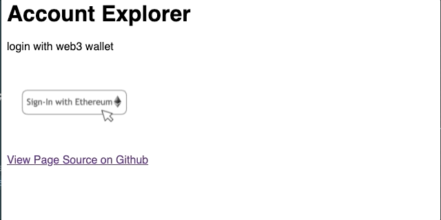

# Sign In With Ethereum

login with web3 wallet

## Features

1.  Launch MetaMask extension on button click
2.  Display public Account information
3.  Show warning if web2 browser
4.  Show ens name if any
5.  Verify user by asking them to sign a message with their private key
6.  Set cookie so user is signed in on next load
7.  log out

## Run

* serve locally `python3 -m http.server 8000 --bind 127.0.0.1`
* open `http://localhost:8000`

## Dependencies

* https://docs.ethers.io/v5/
